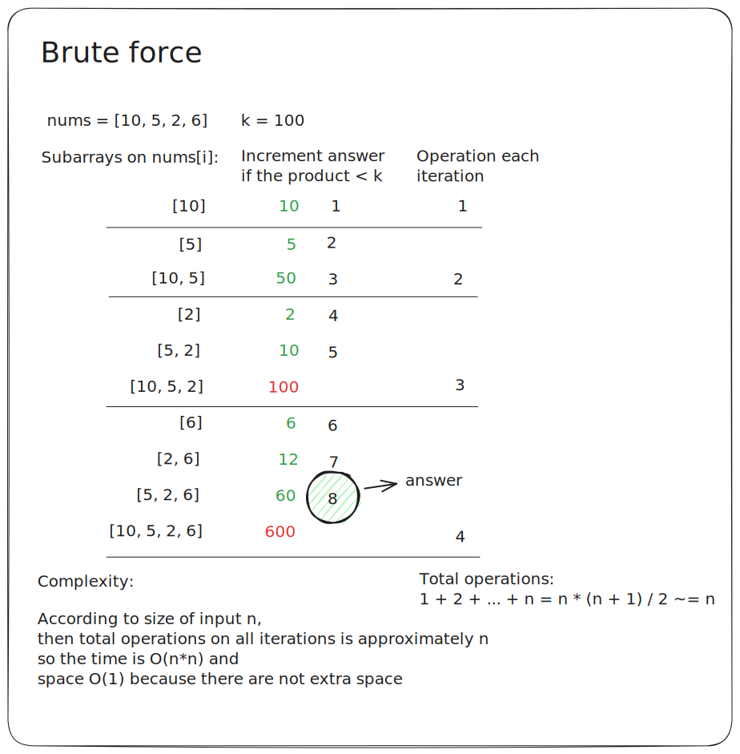
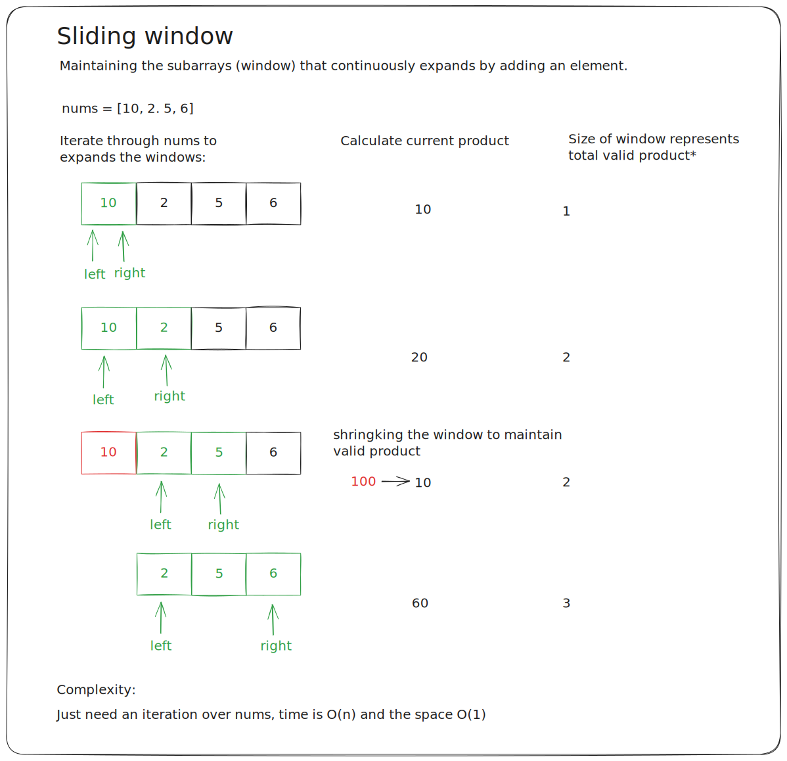
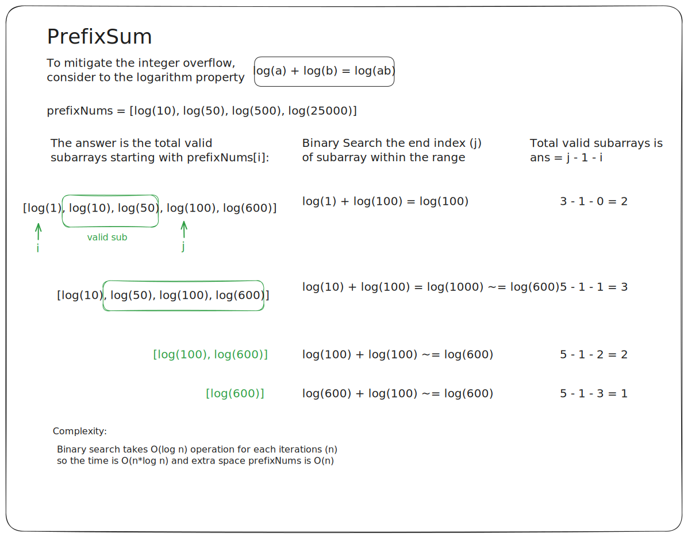

# Notes

To solve problems related to *subarray* intuitively, it's necessary to iterate over the input and then calculate the product of subarrays that can be formed by each input values.

However, this approach becomes costly in term of time complexity. But, it's ok to using straightforward solution such as **brute force** till the constraint of `nums` size is up to 3 * 104.

Due to the larger constraint we need to improve the algorithm. Sliding window is one of a more efficient approach then brute force;

The problem is the `nums[i]` may be way too large and spawn Integer overflow error. To mitigate this, we can convert the product operations into a summation of logarithm as follows;

